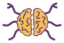

#  Noozoid

A terminal-based mindmap editor for geeks.

The name of the project comes from the Greek words _νους_ (mind) and  _ζούδι_ (small animal).

For now, It is a toy project to improve author's skills with the language and its various libraries. **It is very early stage and is not supposed to work (yet). Please don't use it in production.** :warning:

## Installation

Make sure you have the latest version of crystal (0.35.x)

Build the project

    $ make build

## Usage

### Running noozoid

In your terminal:

    $ _build/noozoid

### Keyboard control (vim-like)

#### NORMAL mode

| Key | Description |
|---|--|
| h | Navigate to parent |
| l | Navigate to child |
| k | Navigate to previous sibling |
| j | Navigate to next sibling |
| r | Navigate to tree root |
| c | Create node |
| i | Enter EDIT mode for current node |
| d | Delete/Cut selected node |
| p | Paste node as a child of selected node |
| v | Toggle node |
| ? | Show this help |
| : | Enter COMMAND mode |

### COMMAND mode

| Command| Description |
|---|--|
| w | Write file |
| e | Load file |
| q | Exit program |
| ESC | Go to normal mode |

### EDIT mode

| Command| Description |
|---|--|
| ESC | Go to normal mode |

Any other key will be written as the content selected node.

## Contributing

Bug reports and pull requests are welcome on GitHub at <https://github.com/glenux/draft-noozoid>.

## License

Noozoid is Copyright © 2021 Glenn ROLLAND. It is free software, and may be redistributed under the terms specified in the LICENSE.txt file.

